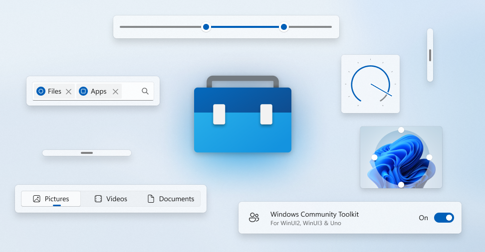

# Windows Community Toolkit 🧰



Welcome to the home of Windows Community Toolkit. Our components are built on top of [WinUI 2](https://aka.ms/winuigithub), [WinUI 3](https://aka.ms/winui3), and [Uno Platform](https://platform.uno)!

They enable developers to build great experiences for Windows with .NET!

_Building something cool? Want to engage with other developers? Want to contribute to the Toolkit? **[Engage in the discussion here!](https://github.com/CommunityToolkit/Windows/discussions)**_

## Getting Started

### [Try out our Sample Gallery from the Microsoft Store](https://aka.ms/windowstoolkitapp)

Want to see the toolkit in action before jumping into the code? Download and play with the [Windows Community Toolkit Gallery](https://www.microsoft.com/store/apps/9nblggh4tlcq) from the Store.

Please read the [Getting Started with the Windows Community Toolkit](https://docs.microsoft.com/dotnet/communitytoolkit/windows/getting-started) page for more detailed information about using the toolkit.

### Windows Community Toolkit Labs

Have an idea for a new feature? Want to checkout the latest things being built. _[Then head over to Windows Community Toolkit Labs](https://aka.ms/toolkit/labs/windows)_.

You can even see the latest components [live in your browser!](https://toolkitlabs.dev)

## Clone the repository

The [tooling](https://github.com/CommunityToolkit/Tooling-Windows-Submodule) is in a submodule, so you'll need to use `--recurse-submodules` when cloning or pulling for the first time:

```shell
git clone --recurse-submodules https://github.com/CommunityToolkit/Windows.git
```

## Build Requirements

- Visual Studio 2022 (UWP & Desktop Workloads for .NET)
- .NET 6 SDK
- Windows App SDK
- Windows SDK 19041

## 🚀 Contribution

We're always looking for a helping hand, [look for issues that we need help with here](https://github.com/CommunityToolkit/Windows/issues?q=is%3Aopen+is%3Aissue+label%3A%22help+wanted%22) or head over to [Windows Community Toolkit Labs](https://aka.ms/toolkit/labs/windows) to try or build new features.

Even just improving our docs and samples for existing components here, or adding new tests can be a huge help!

Check out our [Windows Community Toolkit Wiki](https://aka.ms/wct/wiki) page to learn more about contribution and guidelines in general (to be updated more soon).

## 📦 NuGet Packages

NuGet is a standard package manager for .NET applications which is built into Visual Studio. When you open solution in Visual Studio, choose the *Tools* menu > *NuGet Package Manager* > *Manage NuGet packages for solution…* 

There are now two sets of packages for each component:

- `CommunityToolkit.Uwp.*` for UWP + WinUI 2 or Uno.UI
- `CommunityToolkit.WinUI.*` for Windows App SDK + WinUI 3 or Uno.WinUI

## 📫 Features <a name="supported"></a>

Most features should work with the October 2018 Update (1809) SDK 17763 and above; however, refer to specific documentation on each feature for more information.

## 💠 Principles

1. The toolkit will provide features that are needed for a wide-array of developers, are easy-to-use, and maintainable.
2. As soon as a comparable feature is available in the Windows SDK for Windows, it will be marked as deprecated.
3. We will fix issues forward and stay up-to-date on top of WinUI 2 and 3 updates supporting the minimum OS level that they also support.

## 📄 Code of Conduct

This project has adopted the code of conduct defined by the [Contributor Covenant](http://contributor-covenant.org/)
to clarify expected behavior in our community.
For more information see the [.NET Foundation Code of Conduct](CODE_OF_CONDUCT.md).

## 🏢 .NET Foundation

This project is supported by the [.NET Foundation](http://dotnetfoundation.org).

## 🏆 Contributors

[](https://github.com/CommunityToolkit/Windows/graphs/contributors)

Made with [contrib.rocks](https://contrib.rocks).
