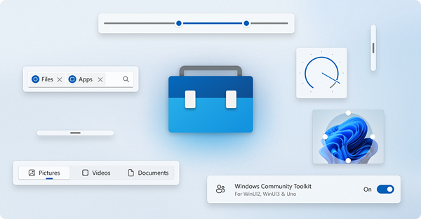
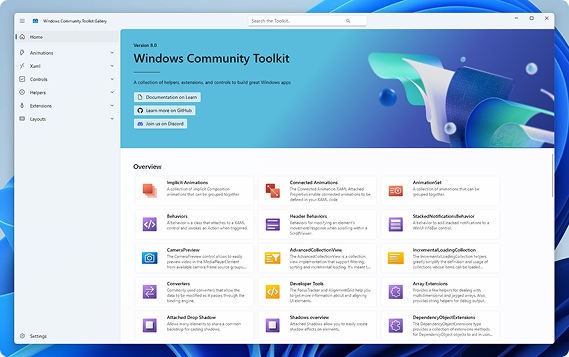

<p align="center">

</p>

<h1 align="center">
    Windows Community Toolkit
</h1>

<h3 align="center">
  <a href="https://docs.microsoft.com/dotnet/communitytoolkit/windows/getting-started">Documentation</a>
  <span> · </span>
  <a href="https://aka.ms/toolkit/labs/windows">Labs</a>
  <span> · </span>
  <a href="https://github.com/CommunityToolkit/Tooling-Windows-Submodule">Tooling</a>
</h3>

The Windows Community Toolkit is a rich set of controls, helpers and extensions designed to streamline Windows app development and to create great experiences for Windows. Our components are built on top of [WinUI 2](https://aka.ms/winuigithub), [WinUI 3](https://aka.ms/winui3), and [Uno Platform](https://platform.uno)!

Please read the [Getting Started with the Windows Community Toolkit](https://docs.microsoft.com/dotnet/communitytoolkit/windows/getting-started) page for more detailed information about using the Toolkit in your app.

> [!NOTE]
> If you're updating from a pre-8.x version of the Windows Community Toolkit, see [our migration notes here](https://aka.ms/toolkit/windows/migration).

## Windows Community Toolkit Gallery app

Want to see the Toolkit in action before jumping into the code? Download and play with the [Windows Community Toolkit Gallery](https://aka.ms/windowstoolkitapp) from the Microsoft Store.

<p align="center">

</p>
<p align="center">
<a href="https://aka.ms/windowstoolkitapp">
    
</a>
</p>


## 👏 Contribute to the Windows Community Toolkit

Have an idea for a new feature? Want to checkout the latest things being built? [Then head over to Windows Community Toolkit Labs](https://aka.ms/toolkit/labs/windows).

Building something cool? Want to engage with other developers? Want to contribute to the Toolkit? **[Engage in the discussion here!](https://github.com/CommunityToolkit/Windows/discussions)**

## 📋 Getting started with Windows Community Toolkit

### 1. Set up the environment

> [!NOTE]
> The Windows Community Toolkit requires [Visual Studio 2022](https://visualstudio.microsoft.com/vs/) or later to build and Windows 10 or later to execute. If you're building an app with WinUI and Windows App SDK for the first time, follow these [installation instructions](https://learn.microsoft.com/windows/apps/get-started/start-here).

**Required [Visual Studio components](https://learn.microsoft.com/windows/apps/get-started/start-here?tabs=vs-2022-17-10#required-workloads-and-components):**
- Windows application development
- .NET desktop development
- Windows 10 SDK, version 2004 (10.0.19041.0)
- Windows 10 21H1 (Build 19043) or greater

### 2. Clone the repository

The [tooling](https://github.com/CommunityToolkit/Tooling-Windows-Submodule) is in a submodule, so you'll need to use `--recurse-submodules` when cloning or pulling for the first time:

```shell
git clone --recurse-submodules https://github.com/CommunityToolkit/Windows.git
```

### 3. Run build scripts & open solution
- Run `dotnet tool restore` from the project root to install SlnGen
- Run build scripts from the [Developer Command Prompt for Visual Studio](https://learn.microsoft.com/visualstudio/ide/reference/command-prompt-powershell) or from elsewhere after adding `MSBuild.exe` to your PATH


## 🚀 Contribution

We're always looking for a helping hand, [look for issues that we need help with here](https://github.com/CommunityToolkit/Windows/issues?q=is%3Aopen+is%3Aissue+label%3A%22help+wanted%22) or head over to [Windows Community Toolkit Labs](https://aka.ms/toolkit/labs/windows) to try or build new features.

Even just improving our docs and samples for existing components here, or adding new tests can be a huge help!

Check out our [Windows Community Toolkit Wiki](https://aka.ms/wct/wiki) page to learn more about contribution and guidelines in general (to be updated more soon).

## 📦 NuGet packages

NuGet is a standard package manager for .NET applications which is built into Visual Studio. When you open solution in Visual Studio, choose the *Tools* menu > *NuGet Package Manager* > *Manage NuGet packages for solution…* 

There are now two sets of packages for each component:

- `CommunityToolkit.Uwp.*` for UWP + WinUI 2 or Uno.UI
- `CommunityToolkit.WinUI.*` for Windows App SDK + WinUI 3 or Uno.WinUI


## 💠 Principles

1. The toolkit will provide features that are needed for a wide-array of developers, are easy-to-use, and maintainable.
2. As soon as a comparable feature is available in the Windows SDK for Windows, it will be marked as deprecated.
3. We will fix issues forward and stay up-to-date on top of WinUI 2 and 3 updates supporting the minimum OS level that they also support.

## 📄 Code of Conduct

This project has adopted the code of conduct defined by the [Contributor Covenant](http://contributor-covenant.org/)
to clarify expected behavior in our community.
For more information see the [.NET Foundation Code of Conduct](CODE_OF_CONDUCT.md).

## 🏢 .NET Foundation

This project is supported by the [.NET Foundation](http://dotnetfoundation.org).

## 🏆 Contributors

[](https://github.com/CommunityToolkit/Windows/graphs/contributors)

Made with [contrib.rocks](https://contrib.rocks).
